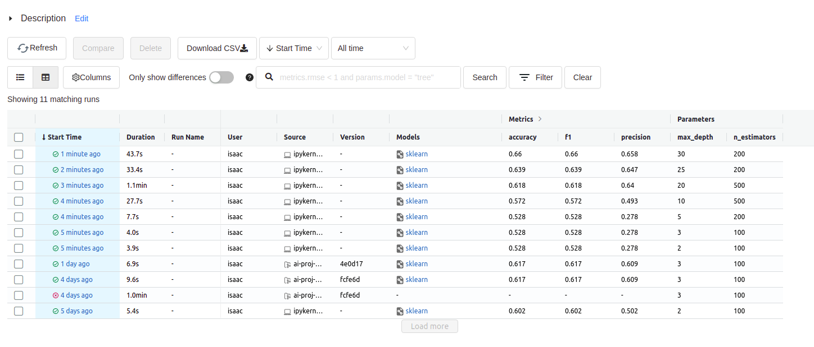
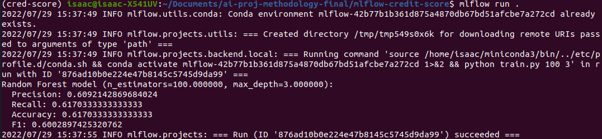
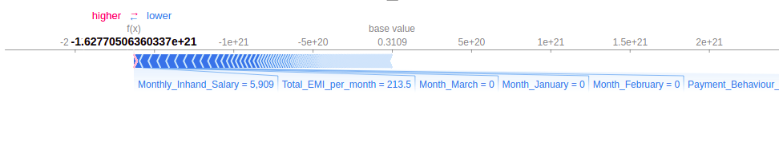
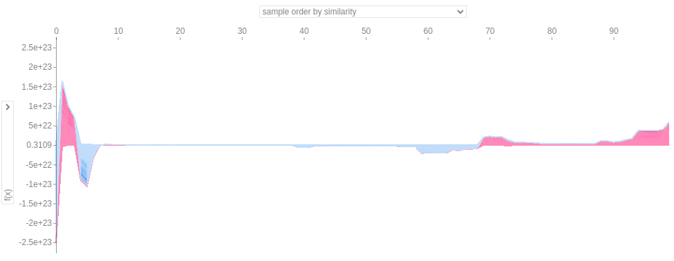
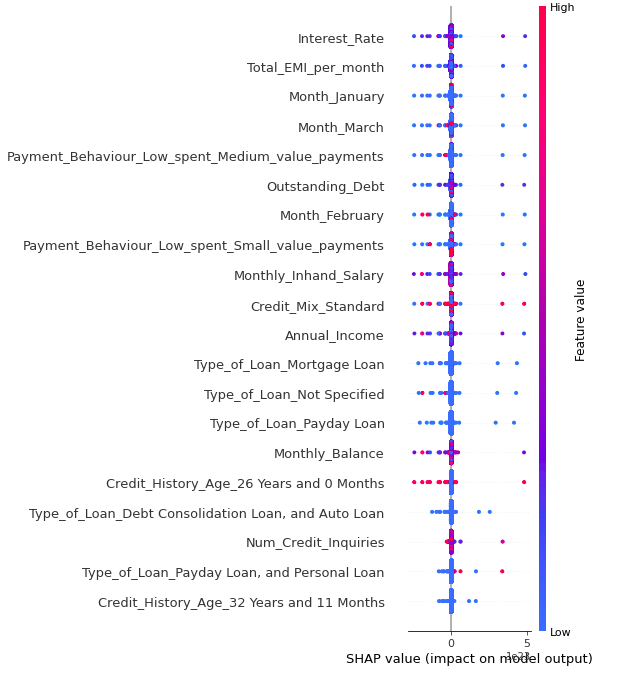

# AI project methodology - Credit score prediction 📊
### Team members 👥
- Sergio Morales
- Isaac Gonzales

## Use case 🛠
In this case, we are analysing and reviewing the dataset presented in the Kaggle challenge of [Credit Score Prediction](https://www.kaggle.com/datasets/prasy46/credit-score-prediction). </br>
The idea is to calculate the credit score of an specific user (customer) given different important fields like the monthly income, the number of credits inquired, or the amount invested monthly among others.

## Set up 💻
Create and activate to get all the dependencies a new virtual environment using `conda` or `miniforge`. 
```
$ conda env create -f conda.yaml
$ conda activate cred-score
```
To finish the setup of our packages, go to the folder `credit-score` 📁 and run the following command _(This is a local package, and therefore, it should be installed manually)_:
```
$ pip install .
```

_To deactivate an active environment, use_
```
$ conda deactivate
```

## MLflow

### Activate MLflow UI
	$ mlflow ui --backend-store-uri mlflow-credit-score/mlruns
	
### View it at http://localhost:5000


### Run MLflow Packing Training Code in conda Environment
	$ cd mlflow-credit-score
	$ mlflow run .


### Deploy the Model Using MLflow Models through a REST API
	$ mlflow models serve --model-uri mlflow-credit-score/mlruns/0/4524303c575b408ea41da2dc4422ffb5/artifacts/model -p 1234

## SHAP Analysis

- File: 
	notebooks/SHAP-analysis.ipynb
### Visualize explanations for a specific point of your data set



### Visualize explanations for samole points of your data set at once


### Visualize a summary plot for each class on the whole dataset
