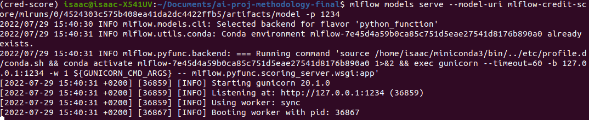
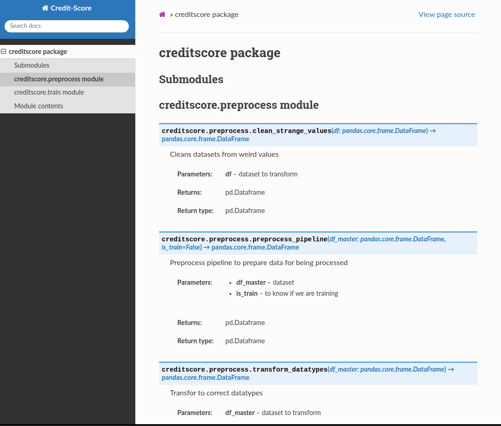

# AI project methodology - Credit score prediction 📊
### Team members 👥
- Sergio Morales (https://github.com/sergioKmoralesV/)
- Isaac Gonzales (https://github.com/Isaacgv)

## Use case 🛠
In this case, we are analysing and reviewing the dataset presented in the Kaggle challenge of [Credit Score Prediction](https://www.kaggle.com/datasets/prasy46/credit-score-prediction). </br>
The idea is to calculate the credit score of a specific user (customer) given different important fields like the monthly income, the number of credits inquired, or the amount invested monthly among others.
### Users 
The uses for this tool can be:
- **Banks:** Trying to understand and define the score of a person that wants to take a credit.
- **Insurances:** They will see the score and decide based on that the risk level to insure a specific person.
- People looking to take a credit in the near future to understand their possibilities and their score.

## Project management 📈
### Methodology
The idea is to use a methodology that allows us tracking the process in small periods of time and for that reason we chose Scrum (https://www.scrum.org/). It is a iterative methodology of development that allows us to get a product (solution) after each small iteration. We didn't took all the rituals of the framework but the following:
- **Daily meetings:** Having daily updates to check the changes and challenges that we might face.
- **Retrospective meeting:** Every iteration (of 1 week), we reviewed the advances and what was missing to define the next iteration and the deliverables of it.
### Roles
We took two different parts of the project to be divided:
- **Data analysis** - In this one, Sergio was in charge of the research and review of the data to ensure quality data and transformations to provide to our model.
- **Machine learning engineering** - This section was taken by Isaac. Taking the responsibility of review, test and enhance our models with the inputs of data we were generating.
- **Code quality** - Sergio was reviewing the quality of the code implemented throughout the application.
- **Documentation** - Isaac was in charge of reviewing the proper documentation to be setup in the project.
## Set up 💻
### General setup
Create and activate to get all the dependencies a new virtual environment using `conda` or `miniforge`. 
```
$ conda env create -f conda.yaml
$ conda activate cred-score
```
To finish the setup of our packages, go to the folder `credit-score` 📁 and run the following command _(This is a local package, and therefore, it should be installed manually)_:
```
$ pip install .
```

_To deactivate an active environment, use_
```
$ conda deactivate
```

## MLflow

### Activate MLflow UI
	$ mlflow ui --backend-store-uri mlflow-credit-score/mlruns
	
### View it at http://localhost:5000


### Run MLflow Packing Training Code in conda Environment
	$ cd mlflow-credit-score
	$ mlflow run .


### Deploy the Model Using MLflow Models through a REST API
	$ mlflow models serve --model-uri mlflow-credit-score/mlruns/0/4524303c575b408ea41da2dc4422ffb5/artifacts/model -p 1234



## SHAP Analysis

- File: 
    notebooks/SHAP-analysis.ipynb
- Visualize explanations for a specific point of your data set<br/>


- Visualize explanations for samole points of your data set at once<br/>


- Visualize a summary plot for each class on the whole dataset<br/>


## Sphinx Documentation

	$ cd docs
	$ make html

